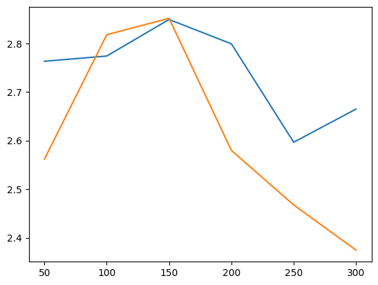

# Тестовое задание для лаборатории Тинькофф

Чтобы запустить у себя:
```
pip install -r requirements.txt
```
Запуск кода происходит через файл main.py, например, так:
```
python main.py --mode "train" --n 250 --version "alignment" --template_src "/data/templates.json" --titles_src "/data/titles.txt" --prompts_src None --loss_type "sigmoid"
```

Другие примеры представлены в `notebooks/launch_colab.ipynb`.



Кажется, что hinge loss позволяет добиться лучшего аллайнмента при меньше потере разнообразия, но во-первых, мой тест проведен на очень маленьком сете дообучения, а во-вторых, из-за содержания в нём рандома, требует перепроведения бОльшего количества экспериментов, чтобы в этом удостовериться.

Дообучить больше, чем на 300 примерах не смогла -- кончилась память на видеокарточке.

Я генерировала N данных при помощи шаблона промптов. Можете увидеть их в data/templates.json. Некоторые наиболее короткие промпты я хотела видеть чуть с большей вероятностью, чем остальные. Размер выборки варьировала через параметр n в main.py. Контрольные измерения проводила на отдельной выборке промптов (data/prompts_test.txt) размером в 100 штук.

Я предполагаю, что для улучшения метрик, можно пробовать оценивание ЛЛМ-кой (этой же или другой), но это будет занимать больше времени, а также можно попробовать применить кросс-энкодер.

Другие данные можете посмотреть в папке results.